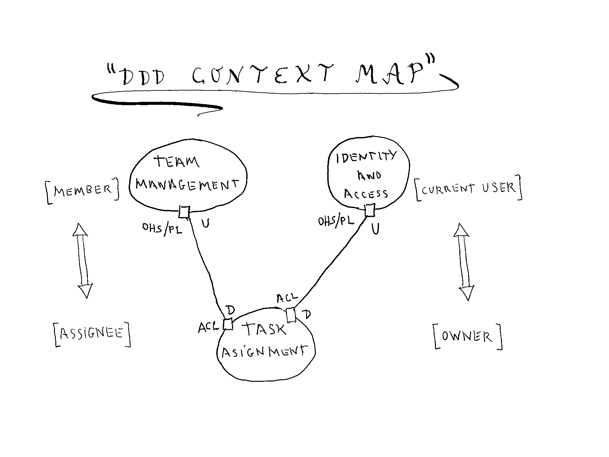
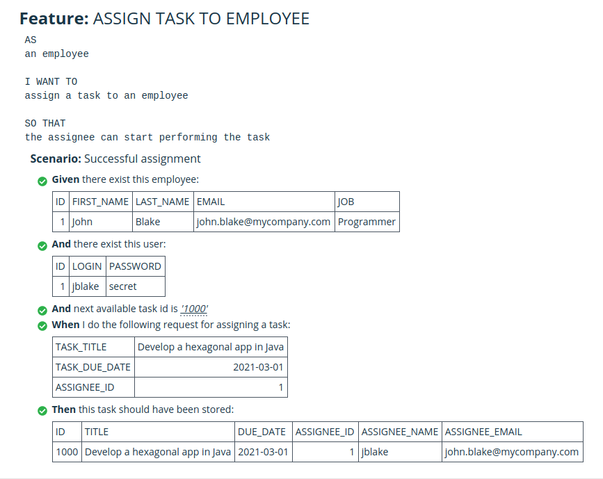

# Task Management (Hexagonal App with ACL)

Simple code example for illustrating the article

https://jmgarridopaz.github.io/content/therightboundary.html

WARNING: It has been done quickly so: there's no exception handling, no dependencies between packages (but I take care of them), no implementation hiding (all types are public), just programmed the code needed to run one test case, ... but those things don't matter now for the topic of the article.

___Task Management___ is an application, a collaborative tool, used by employees of a company for assigning tasks to each other. The domain model has concepts like "assignee", that is the employee who a task is assigned to, and has to perform it. An assignee has an id, a unique short name kindof an alias, and an email.

We assume two already existing systems:

- _Company_, with information about employees, which have properties like id, first name, last name, email, job.
- _Identity and Access_, with information about the users of our application. Users have an id, a login name, and a password. A user is an employee, the user id is the employee id.

Using "Domain Driven Design" ( DDD ) strategic patterns, we have the following context map showing how our application integrates with these external systems:

Both "upstream" (U) systems offer an "Open Host Service / Published Language" (OHS/PL), which is a HTTP REST API as the OHS, using JSON as the PL.

Our _Task Management_ application is "downstream" (D), with an "Anti Corruption Layer" (ACL) for translating concepts from U models into our D model. So we build an assignee from an employee (id and email) and a user (login name).

__Implementing "Task Management" application using "Hexagonal Architecture".__

This drawing shows interfaces, classes and packages from source code:

Ports are APIs isolating the application from the real world. In our case, both external systems are real world items (http repositories). So there will be driven ports for getting information (employees and users) from them.

When our application needs to get an assignee from an id, it uses a domain service interface ("AssigneeService"). The ACL implements this interface in two steps:

1. Accesses the repositories using ports and adapters, in order to get the objects (employe and user) from the external systems. This operation deals with techonology.
2. Translates employee and user objects into an "assignee" object. This is a semantic operation, no technologies are involved.

We put the ACL translation logic inside the hexagon but outside the domain, because it doesn't deal with technology (it isn't infraestructure code), but it deals with concepts that don't belong to our domain (employee and user).

Does this mean or suggest, specially to junior developers, that they could use technology into this ACL because it is outside the domain? Absolutely no, because it is inside the hexagon, it isn't infrastructure code... And rule number one in hexagonal architecture is to isolate the hexagon from real world using APIs (ports). Moreover, it is an architect responsibility to avoid using technology inside the hexagon, so that an inexpert developer couldn't write infrastructure code there. With Maven this is easy to achieve: Just don't put any dependency item in the pom file of the hexagon module.

This is analog to "Application Layer" in the driver side. It is inside the hexagon, but outside the domain. This layer is technology agnostic too, it isn't infrastructure code, but it isn't the domain. It has concepts that don't belong to the domain, like DTOs and DPOs, that we expose to the real world, protecting our domain from external access.

__About testing:__

Configurable Dependency pattern allows us to swap external real world items (web repositories) for test doubles (stubs), so that we can test the hexagon in isolation from techonologies.

ACL translation logic is covered by these tests too, since it is not technological stuff and so it belongs to the hexagon.

Here is a pretty cool Cucumber html test report, for the test case that I've implemented in the example:

As we can see, employee and user concepts appear in the test case but they don't belong to our domain, they belong to _Company_ and _Identity & Access_ external systems. Why is this? Because we are testing the whole hexagon including the ACL logic, not just the domain. So the data that feed our test case in the "given" clause are the data from the repositories (employees and users). And the driver actor of the real system is also an employee, who is the final real world user of the application, that's why it appears in the "AS a..." clause of the feature.

Testing the hexagon in isolation driven by test cases, mocking external technologies, is one of the main goals of hexagonal architecture. Putting ACL logic outside the hexagon would break this.

Does this mean that we cannot just test the domain without the ACL? Absolutely no, you can mock the ACL as well. But that would be testing the inside of the hexagon, just like if you wanted to test any other component of the inside. And hexagonal architecture doesn't say anything about it.

### Development environment:

- Java 1.8.0_261

- Maven 3.5.4

- Eclipse IDE 2019-12 (4.14.0)

- Ubuntu 18.04.5 LTS (Linux 5.4.0-60-generic)

### Instructions:

- Download and extract this GitHub repository to a local directory on your computer ( `<tm_dir>` )

- Generate jar file:

  ~~~
  cd <tm_dir>
  mvn clean package
  ~~~

- Run jar file:

  ~~~
  cd <tm_dir>
  java -jar ./target/task-management-1.0.0.jar
  ~~~
