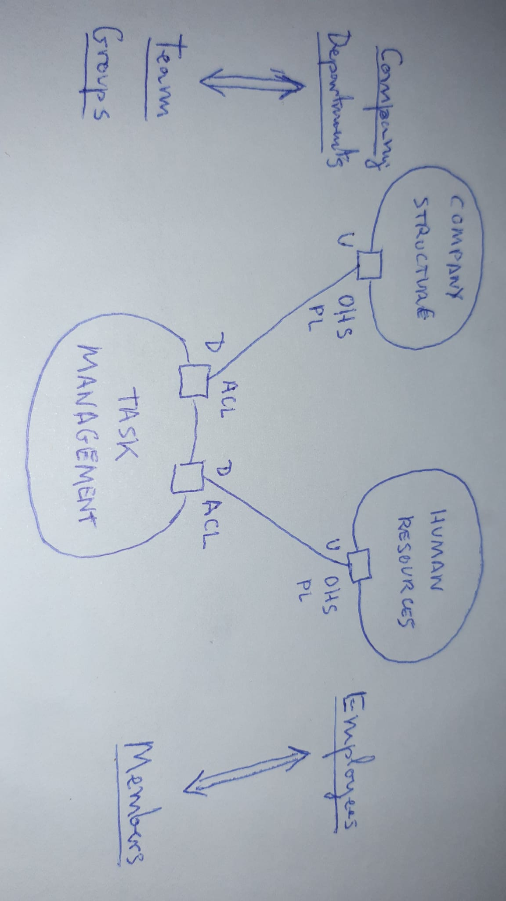
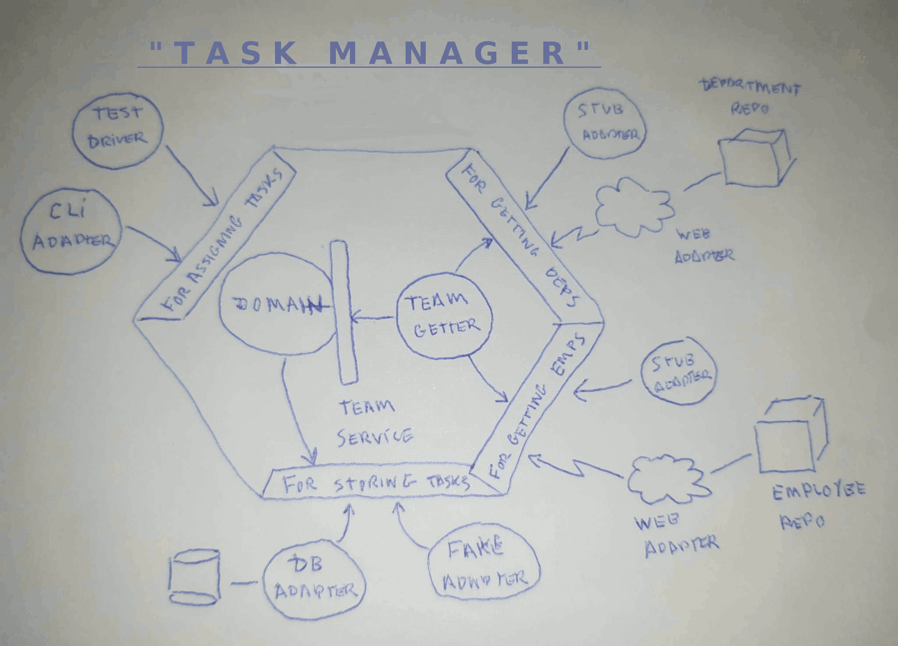

# task-management

# >>>>>>>>>> IN PROGRESS <<<<<<<<<<

Simple code example for illustrating the article https://jmgarridopaz.github.io/content/therightboundary.html

It has be done quickly so: there's no error checking, no dependency management (just one module, but I take care of dependencies between packages), all types are public, the core domain is simple (not rich), I didn't program all the adapters (just the ones needed for doing a use case test), etc. But those things don't matter now for the topic of the article.

**Task Management** is an application that members of a team can use, for assigning tasks to either another team member or to a group of members.

This application is going to be used by the employees of a company, which is structured in departments.

We are going to suppose that we have 2 external systems: _Company Structure_, with information about departments; and _Human Resources_, with information about employees. So that we have the following DDD context map:

- _Company Structure & Task Management contexts integration_: Company Structure is upstream and it offers information about the company and its departments with an OHS/PL (REST API with JSON representation). Task Management is downstream, with an ACL for translating upstream model into downstream model (the company is a team, and departments are groups of team members).

- _Human Resources & Task Management contexts integration_: Human Resources is upstream and it offers information about employees with an OHS/PL (REST API with JSON representation). Task Management is downstream, with an ACL for translating upstream model into downstream model (employees are team members).

Both integrations will be synchronous, i.e. Task Management context will send a web request and wait for response everytime it needs information from the remote contexts. Another option for integration would be asynchronously, receiving the remote information by listening to events thrown by the upstream contexts, but that's not the topic now.

The topic is the following: "DDD infra code (ACL) doesn't match HA infra code (HA adapter)".

The concept of ACL is wider than the HA adapter, since it does semantic translation besides technological one.

Once the HA adapter has fetched the concept from the repository (upstream context), the hexagon has to translate it into terms of our domain.

So, for DDD, the semantic translation is part of the infra code. But from HA point of view, the infra code is just the technological adapter for the repository.

That's what I say, HA is what it is, not what I want it to be.

So if I want to fit DDD into HA, I put that semantic translation inside the hexagon but outside the domain. You are still protecting your domain with a domain service interface.

Regarding tests, this way ACL logic doesn't scape from acceptance tests (business logic tests), since it belongs to the hexagon.

Testing the hexagon in isolation driven by test drivers, mocking external technologies, is one of the main goals of HA, and putting ACL logic outside breaks this.

## Development Environment:

- Java 1.8

- Maven 3.5.4

- Eclipse IDE 2019-12

- Ubuntu 18.04

## Compile & Run:

- Download the repository.

- mvn clean package

- java -jar ./target/task-management-1.0.0-spring-boot.jar
